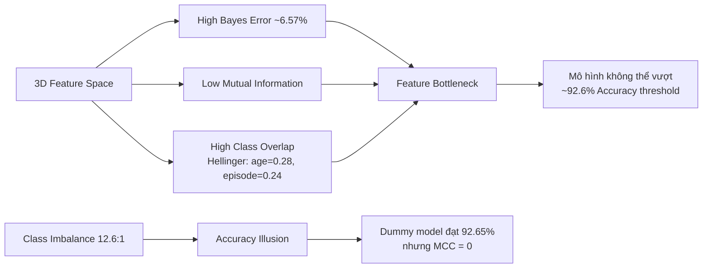
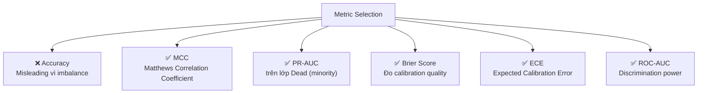
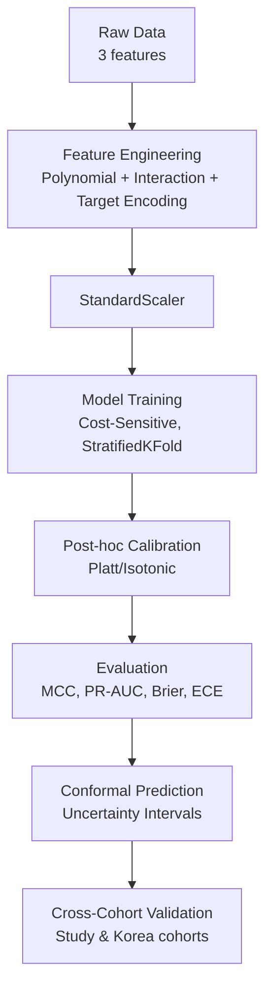

# 📊 Chiến Lược Xử Lý Dữ Liệu & Huấn Luyện Mô Hình
## Dự án: Sepsis Survival Minimal Clinical Records

> [!IMPORTANT]
> Bộ dữ liệu này có **đặc trưng cốt lõi**: chỉ 3 features, tương quan thấp, mất cân bằng lớp nghiêm trọng (~14.42% tử vong). Điều này tạo ra một **Feature Bottleneck** — nghĩa là giới hạn của dự đoán không nằm ở mô hình, mà nằm ở chính dữ liệu.

---

## 1. Phân Tích Đặc Điểm Dữ Liệu

### 1.1. Tóm tắt Dataset

| Thuộc tính | Giá trị |
|---|---|
| **Nguồn** | UCI ML Repository (ID: 827) |
| **Tổng mẫu (Primary Cohort)** | 110,204 admissions |
| **Study Cohort** | 19,051 admissions |
| **Validation Cohort** | 137 patients (Korea) |
| **Số features** | 3 (`age`, `sex`, `episode_number`) |
| **Target** | `hospital_outcome_1alive_0dead` (Binary) |
| **Tỷ lệ sống** | ~92.65% |
| **Tỷ lệ tử vong (minority)** | ~7.35% |
| **Imbalance Ratio** | ~12.6:1 |
| **Missing values** | Không có |

### 1.2. Các Thách Thức Hệ Thống



> [!WARNING]
> **Kết luận từ Week 1 & 2**: Bayes Error Bound ≈ 6.57%, tiệm cận Baseline Mortality Rate (7.35%). Điều này chứng minh rằng **không mô hình nào** (dù phức tạp đến đâu) có thể thực sự dự đoán tốt hơn "mọi người đều sống" chỉ với 3 features này. Mọi nỗ lực phải tập trung vào **quality of prediction** (calibration, uncertainty) thay vì cạnh tranh Accuracy.

---

## 2. Chiến Lược Xử Lý Dữ Liệu

### 2.1. Feature Engineering — Mở Rộng Không Gian Đặc Trưng

Với chỉ 3 features, **feature engineering là phương pháp quan trọng nhất** để cải thiện. Các kỹ thuật đề xuất:

#### a) Polynomial Features (Đặc trưng đa thức)
```
age² — Capture non-linear age effects (tử vong tăng phi tuyến theo tuổi)
episode_number² — Recurrent sepsis effects
```

#### b) Interaction Terms (Tương tác giữa các biến)
```
age × sex — Hiệu ứng tuổi khác nhau giữa nam/nữ
age × episode_number — Tuổi cao + nhiều đợt sepsis = rủi ro tăng
sex × episode_number — Giới tính × tần suất bệnh
age × sex × episode_number — Three-way interaction
```

#### c) Domain-Driven Binning (Phân nhóm lâm sàng)
```
age_bin: [0-18, 19-40, 41-60, 61-80, 81+]
→ One-hot encode các bins
→ Mortality rate encoding: thay age_bin bằng tỷ lệ tử vong trung bình của nhóm
```

#### d) Target Encoding (Subgroup Mortality Rate)
```
Tạo biến: P(Dead | age_bin, sex) = Tỷ lệ tử vong theo nhóm tuổi-giới
→ Sử dụng K-Fold target encoding để tránh data leakage
```

> [!TIP]
> Đây là kỹ thuật **mạnh nhất** cho dataset này. Paper của Chicco & Jurman (2020) cho thấy `age` là trụ cột dự đoán (Cohen's d = 0.66). Bằng cách tạo interaction terms và target encoding, ta biến 3D space thành 8-12D space, giúp mô hình tìm ranh giới phân loại tốt hơn.

### 2.2. Xử Lý Mất Cân Bằng Lớp

> [!CAUTION]
> **KHÔNG nên dùng SMOTE/oversampling!** Paper của Carchiolo & Malgeri (2024) đã chứng minh: SMOTE trên dataset ít features tạo ra "Accuracy Illusion" — metric tăng cao nhưng thực tế mô hình học noise, không phải signal.

#### Phương pháp đề xuất:

| Phương pháp | Mô tả | Ưu tiên |
|---|---|---|
| **Cost-Sensitive Learning** | `class_weight='balanced'` trong sklearn | ⭐ Cao nhất |
| **Asymmetric Loss** | Focal Loss hoặc custom loss: FN penalty > FP penalty | ⭐ Cao |
| **Threshold Tuning** | Điều chỉnh decision threshold thay vì dùng 0.5 | ⭐ Cao |
| **Stratified Sampling** | Đảm bảo train/val/test giữ tỷ lệ lớp | ⭐ Bắt buộc |
| **Under-sampling** | Dùng ensemble under-sampling (BalancedBaggingClassifier) | Trung bình |

### 2.3. Cải Cách Metric — Bỏ Accuracy, Dùng Metric Phù Hợp



### 2.4. Cross-Validation Strategy

```python
# StratifiedKFold (BẮT BUỘC): giữ tỷ lệ lớp trong mỗi fold
from sklearn.model_selection import RepeatedStratifiedKFold

cv = RepeatedStratifiedKFold(n_splits=5, n_repeats=3, random_state=42)
```

---

## 3. Chiến Lược Huấn Luyện Mô Hình

### Tier 1: Calibrated Baselines (Tuần tiếp theo)

| Mô hình | Config | Mục tiêu |
|---|---|---|
| **Logistic Regression** | `class_weight='balanced'` + polynomial features | Baseline có calibration tốt nhất |
| **CalibratedClassifierCV** | Logistic Regression + Platt Scaling hoặc Isotonic Regression | Sửa miscalibration |

> [!NOTE]
> Week 2 đã phát hiện: Logistic Regression với `class_weight='balanced'` tạo Brier Score = 0.2246 (tệ hơn Dummy 0.0735). Đây là hiện tượng **over-confidence** cần hậu hiệu chuẩn.

### Tier 2: Tree-Based Ensembles (Phù hợp với tabular data)

| Mô hình | Config | Ghi chú |
|---|---|---|
| **XGBoost** | `scale_pos_weight = imbalance_ratio`, `eval_metric='aucpr'` | Mạnh nhất cho tabular |
| **LightGBM** | `is_unbalance=True` hoặc custom `scale_pos_weight` | Nhanh, hiệu quả |
| **Random Forest** | `class_weight='balanced_subsample'` | Interpretable |
| **BalancedBaggingClassifier** | Ensemble under-sampling | Xử lý imbalance tự nhiên |

### Tier 3: Uncertainty Quantification (Mục tiêu chính)

| Phương pháp | Mô tả |
|---|---|
| **Conformal Prediction** | Tạo prediction sets với coverage guarantee (VD: 90% confidence) |
| **Calibration Curves** | Reliability Diagram để đánh giá predicted probability vs actual |
| **Monte Carlo Dropout** | (Nếu dùng Neural Net) Ước lượng uncertainty |
| **Platt Scaling / Isotonic Regression** | Post-hoc calibration cho bất kỳ model nào |

### Pipeline Đề Xuất



---

## 4. Các Bài Báo Liên Quan & Tóm Tắt Phương Pháp

### Paper 1: Chicco & Jurman (2020) — Bài báo gốc
- **Tiêu đề:** *Survival prediction of patients with sepsis from age, sex, and septic episode number alone*
- **Link:** [Nature Scientific Reports 10, 17156](https://doi.org/10.1038/s41598-020-73558-3)
- **Tóm tắt phương pháp:**
  - Sử dụng 10+ classifiers (Random Forest, XGBoost, SVM, etc.) trên 3 features
  - Cross-validation 5-fold stratified
  - **Phát hiện chính:** Mô hình sụp đổ khi cross-cohort validation (Norway → Korea), ROC-AUC giảm từ ~0.7 xuống 0.568
  - **Hạn chế:** Đánh giá bằng Accuracy (misleading), không xử lý calibration

### Paper 2: Carchiolo & Malgeri (2024) — Dataset Balancing
- **Tiêu đề:** *Dataset Balancing in Disease Prediction*
- **Link:** [DATA 2024 Conference, SciTePress](https://doi.org/10.5220/0012755700003756)
- **Tóm tắt phương pháp:**
  - Đánh giá SMOTE + 10 classifiers trên Sepsis Minimal dataset
  - Claim Accuracy 0.982 sau SMOTE
  - **Vấn đề nghiêm trọng:** Rơi vào "Accuracy Illusion" — SMOTE trên dataset ít features chỉ memorize majority class patterns
  - **Bài học:** Không nên đánh giá bằng Accuracy khi imbalanced > 10:1

### Paper 3: He & Garcia (2009) — Class Imbalance Survey
- **Tiêu đề:** *Learning from Imbalanced Data*
- **Link:** [IEEE Transactions on Knowledge and Data Engineering, 21(9)](https://doi.org/10.1109/TKDE.2008.239)
- **Tóm tắt phương pháp:**
  - Survey toàn diện nhất về class imbalance
  - So sánh: Oversampling (SMOTE) vs Under-sampling vs Cost-sensitive vs Ensemble
  - **Khuyến nghị chính:** Cost-sensitive learning vượt trội oversampling khi features ít và overlap lớn
  - Đề xuất metric: G-mean, F-measure trên minority class

### Paper 4: Niculescu-Mizil & Caruana (2005) — Calibration
- **Tiêu đề:** *Predicting Good Probabilities with Supervised Learning*
- **Link:** [ICML 2005](https://doi.org/10.1145/1102351.1102430)
- **Tóm tắt phương pháp:**
  - So sánh calibration quality của 10 classifiers
  - **Phát hiện:** Boosted trees và SVM "over-confident", cần Platt Scaling
  - Logistic Regression có calibration tốt nhất ban đầu, nhưng `class_weight` làm hỏng
  - **Đề xuất:** Luôn dùng CalibratedClassifierCV cho medical predictions

### Paper 5: Vovk, Gammerman & Shafer (2005) — Conformal Prediction
- **Tiêu đề:** *Algorithmic Learning in a Random World*
- **Link:** [Springer](https://doi.org/10.1007/b106715)
- **Tóm tắt phương pháp:**
  - Framework lý thuyết cho Conformal Prediction
  - Tạo prediction sets với **coverage guarantee** (VD: 95% của dự đoán sẽ chứa true label)
  - **Ứng dụng cho Sepsis:** Thay vì predict "sống/chết", output là {"sống"}, {"chết"}, hoặc {"sống, chết"} (uncertain)
  - Trường hợp uncertain → flag cho bác sĩ review

### Paper 6: Cover & Hart (1967) — Bayes Error Bound
- **Tiêu đề:** *Nearest Neighbor Pattern Classification*
- **Link:** [IEEE Trans. Information Theory, 13(1)](https://doi.org/10.1109/TIT.1967.1053964)
- **Tóm tắt phương pháp:**
  - Chứng minh: Lỗi 1-NN ≤ 2R*(1 - R*), với R* là Bayes Error
  - **Ứng dụng trong project:** Dùng 1-NN error (12.27%) để ước lượng Bayes Error Bound (~6.57%)
  - Kết quả: Feature Bottleneck nghiêm trọng — giới hạn lý thuyết gần bằng baseline mortality rate

---

## 5. Kế Hoạch Hành Động Cụ Thể

### Bước 1: Feature Engineering Pipeline
```python
from sklearn.preprocessing import PolynomialFeatures, StandardScaler
from sklearn.pipeline import Pipeline
from category_encoders import TargetEncoder

# 1. Polynomial + Interaction features (degree=2)
poly = PolynomialFeatures(degree=2, interaction_only=False, include_bias=False)
# Từ 3 features → 9 features: age, sex, ep, age², age×sex, age×ep, sex², sex×ep, ep²

# 2. Target Encoding cho demographic subgroups
# Cẩn thận: dùng K-Fold CV encoding để tránh leakage
```

### Bước 2: Model Comparison Pipeline
```python
from sklearn.linear_model import LogisticRegression
from sklearn.ensemble import RandomForestClassifier
from sklearn.calibration import CalibratedClassifierCV
from xgboost import XGBClassifier
from sklearn.metrics import matthews_corrcoef, brier_score_loss, average_precision_score

models = {
    'LR_balanced': LogisticRegression(class_weight='balanced', max_iter=1000),
    'RF_balanced': RandomForestClassifier(class_weight='balanced_subsample', n_estimators=100),
    'XGB_weighted': XGBClassifier(scale_pos_weight=12.6, eval_metric='aucpr'),
}

# Wrap mỗi model với CalibratedClassifierCV
for name, model in models.items():
    calibrated = CalibratedClassifierCV(model, method='isotonic', cv=5)
```

### Bước 3: Evaluation Framework
```python
# Metric chính:
# 1. MCC (Matthews Correlation Coefficient)
# 2. PR-AUC trên class Dead
# 3. Brier Score
# 4. ECE (Expected Calibration Error)
# 5. Reliability Diagram
```

### Bước 4: Cross-Cohort Validation
```python
# Train trên Primary Cohort → Test trên Study Cohort & Validation Cohort
# Mục tiêu: kiểm tra distribution shift (vấn đề chính của Chicco & Jurman 2020)
```

---

## 6. Tổng Kết

> [!IMPORTANT]
> **Chiến lược cốt lõi:** Với dataset 3 features, tương quan thấp, imbalance nặng:
> 1. **Feature Engineering** là ưu tiên #1 (polynomial, interaction, target encoding)
> 2. **Cost-Sensitive Learning** thay vì SMOTE
> 3. **Đánh giá bằng MCC, PR-AUC, Brier Score** — KHÔNG dùng Accuracy
> 4. **Post-hoc Calibration** (Platt/Isotonic) cho mọi model
> 5. **Conformal Prediction** cho uncertainty quantification
> 6. **Cross-cohort validation** để kiểm tra generalization
>
> Mục tiêu không phải là "đạt Accuracy cao", mà là **biết khi nào mô hình không chắc chắn** — để flag cho bác sĩ review.
