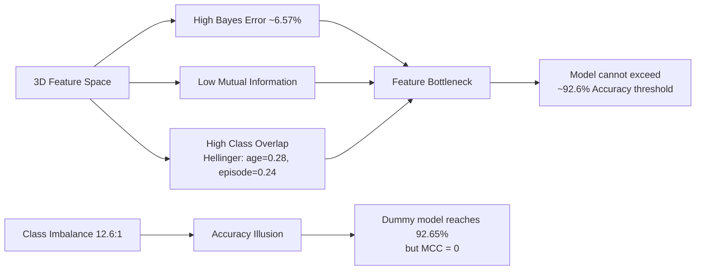
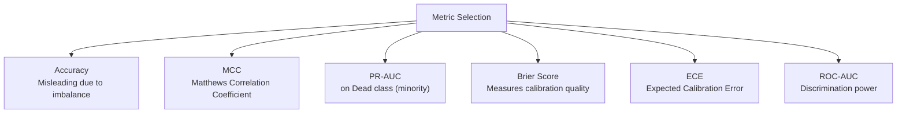
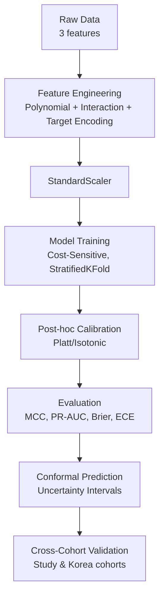

# Data Processing & Model Training Strategy
## Project: Sepsis Survival Minimal Clinical Records

> [!IMPORTANT]
> This dataset has a **core characteristic**: only 3 features, low correlation, severe class imbalance (~14.42% mortality). This creates a **Feature Bottleneck** — meaning the prediction limit lies in the data itself, not in the model.

---

## 1. Data Characteristics Analysis

### 1.1. Dataset Summary

| Attribute | Value |
|---|---|
| **Source** | UCI ML Repository (ID: 827) |
| **Total Samples (Primary Cohort)** | 110,204 admissions |
| **Study Cohort** | 19,051 admissions |
| **Validation Cohort** | 137 patients (Korea) |
| **Number of Features** | 3 (`age`, `sex`, `episode_number`) |
| **Target** | `hospital_outcome_1alive_0dead` (Binary) |
| **Survival Rate** | ~92.65% |
| **Mortality Rate (minority)** | ~7.35% |
| **Imbalance Ratio** | ~12.6:1 |
| **Missing Values** | None |

### 1.2. Systemic Challenges



> [!WARNING]
> **Conclusion from Week 1 & 2**: Bayes Error Bound is approximately 6.57%, asymptotically close to the Baseline Mortality Rate (7.35%). This proves that **no model** (regardless of complexity) can truly predict better than "everyone survives" using only these 3 features. All efforts must focus on **quality of prediction** (calibration, uncertainty) rather than competing on Accuracy.

---

## 2. Data Processing Strategy

### 2.1. Feature Engineering — Expanding the Feature Space

With only 3 features, **feature engineering is the most critical method** for improvement. Proposed techniques:

#### a) Polynomial Features
```
age^2 — Capture non-linear age effects (mortality increases non-linearly with age)
episode_number^2 — Recurrent sepsis effects
```

#### b) Interaction Terms
```
age x sex — Age effects differ between male/female
age x episode_number — Older age + multiple sepsis episodes = increased risk
sex x episode_number — Gender x disease frequency
age x sex x episode_number — Three-way interaction
```

#### c) Domain-Driven Binning
```
age_bin: [0-18, 19-40, 41-60, 61-80, 81+]
-> One-hot encode the bins
-> Mortality rate encoding: replace age_bin with the average mortality rate of the group
```

#### d) Target Encoding (Subgroup Mortality Rate)
```
Create variable: P(Dead | age_bin, sex) = Mortality rate by age-gender subgroup
-> Use K-Fold target encoding to avoid data leakage
```

> [!TIP]
> This is the **most powerful technique** for this dataset. Chicco & Jurman (2020) showed that `age` is the prediction backbone (Cohen's d = 0.66). By creating interaction terms and target encoding, we transform the 3D space into an 8-12D space, helping the model find better classification boundaries.

### 2.2. Handling Class Imbalance

> [!CAUTION]
> **Do NOT use SMOTE/oversampling!** Carchiolo & Malgeri (2024) demonstrated that SMOTE on low-feature datasets creates an "Accuracy Illusion" — metrics appear high but the model actually learns noise, not signal.

#### Proposed Methods:

| Method | Description | Priority |
|---|---|---|
| **Cost-Sensitive Learning** | `class_weight='balanced'` in sklearn | Highest |
| **Asymmetric Loss** | Focal Loss or custom loss: FN penalty > FP penalty | High |
| **Threshold Tuning** | Adjust decision threshold instead of using 0.5 | High |
| **Stratified Sampling** | Ensure train/val/test maintain class ratios | Mandatory |
| **Under-sampling** | Use ensemble under-sampling (BalancedBaggingClassifier) | Medium |

### 2.3. Metric Reform — Discard Accuracy, Use Appropriate Metrics



### 2.4. Cross-Validation Strategy

```python
# StratifiedKFold (MANDATORY): maintains class ratios in each fold
from sklearn.model_selection import RepeatedStratifiedKFold

cv = RepeatedStratifiedKFold(n_splits=5, n_repeats=3, random_state=42)
```

---

## 3. Model Training Strategy

### Tier 1: Calibrated Baselines (Next Week)

| Model | Config | Objective |
|---|---|---|
| **Logistic Regression** | `class_weight='balanced'` + polynomial features | Baseline with best calibration |
| **CalibratedClassifierCV** | Logistic Regression + Platt Scaling or Isotonic Regression | Fix miscalibration |

> [!NOTE]
> Week 2 discovered: Logistic Regression with `class_weight='balanced'` produces Brier Score = 0.2246 (worse than Dummy at 0.0735). This is an **over-confidence** phenomenon requiring post-hoc calibration.

### Tier 2: Tree-Based Ensembles (Suitable for Tabular Data)

| Model | Config | Notes |
|---|---|---|
| **XGBoost** | `scale_pos_weight = imbalance_ratio`, `eval_metric='aucpr'` | Strongest for tabular |
| **LightGBM** | `is_unbalance=True` or custom `scale_pos_weight` | Fast, efficient |
| **Random Forest** | `class_weight='balanced_subsample'` | Interpretable |
| **BalancedBaggingClassifier** | Ensemble under-sampling | Handles imbalance naturally |

### Tier 3: Uncertainty Quantification (Primary Goal)

| Method | Description |
|---|---|
| **Conformal Prediction** | Generate prediction sets with coverage guarantee (e.g., 90% confidence) |
| **Calibration Curves** | Reliability Diagram to evaluate predicted probability vs actual |
| **Monte Carlo Dropout** | (If using Neural Net) Estimate uncertainty |
| **Platt Scaling / Isotonic Regression** | Post-hoc calibration for any model |

### Proposed Pipeline



---

## 4. Related Papers & Method Summaries

### Paper 1: Chicco & Jurman (2020) — Original Paper
- **Title:** *Survival prediction of patients with sepsis from age, sex, and septic episode number alone*
- **Link:** [Nature Scientific Reports 10, 17156](https://doi.org/10.1038/s41598-020-73558-3)
- **Method Summary:**
  - Used 10+ classifiers (Random Forest, XGBoost, SVM, etc.) on 3 features
  - 5-fold stratified cross-validation
  - **Key Finding:** Models collapsed during cross-cohort validation (Norway to Korea), ROC-AUC dropped from ~0.7 to 0.568
  - **Limitation:** Evaluated using Accuracy (misleading), did not address calibration

### Paper 2: Carchiolo & Malgeri (2024) — Dataset Balancing
- **Title:** *Dataset Balancing in Disease Prediction*
- **Link:** [DATA 2024 Conference, SciTePress](https://doi.org/10.5220/0012755700003756)
- **Method Summary:**
  - Evaluated SMOTE + 10 classifiers on the Sepsis Minimal dataset
  - Claimed Accuracy of 0.982 after SMOTE
  - **Serious Issue:** Falls into the "Accuracy Illusion" — SMOTE on low-feature datasets only memorizes majority class patterns
  - **Lesson:** Should not evaluate using Accuracy when imbalance ratio exceeds 10:1

### Paper 3: He & Garcia (2009) — Class Imbalance Survey
- **Title:** *Learning from Imbalanced Data*
- **Link:** [IEEE Transactions on Knowledge and Data Engineering, 21(9)](https://doi.org/10.1109/TKDE.2008.239)
- **Method Summary:**
  - The most comprehensive survey on class imbalance
  - Comparison: Oversampling (SMOTE) vs Under-sampling vs Cost-sensitive vs Ensemble
  - **Key Recommendation:** Cost-sensitive learning outperforms oversampling when features are few and class overlap is high
  - Proposed metrics: G-mean, F-measure on minority class

### Paper 4: Niculescu-Mizil & Caruana (2005) — Calibration
- **Title:** *Predicting Good Probabilities with Supervised Learning*
- **Link:** [ICML 2005](https://doi.org/10.1145/1102351.1102430)
- **Method Summary:**
  - Compared calibration quality of 10 classifiers
  - **Finding:** Boosted trees and SVM are "over-confident", require Platt Scaling
  - Logistic Regression has the best initial calibration, but `class_weight` degrades it
  - **Recommendation:** Always use CalibratedClassifierCV for medical predictions

### Paper 5: Vovk, Gammerman & Shafer (2005) — Conformal Prediction
- **Title:** *Algorithmic Learning in a Random World*
- **Link:** [Springer](https://doi.org/10.1007/b106715)
- **Method Summary:**
  - Theoretical framework for Conformal Prediction
  - Generates prediction sets with **coverage guarantee** (e.g., 95% of predictions will contain the true label)
  - **Application to Sepsis:** Instead of predicting "alive/dead", output is {"alive"}, {"dead"}, or {"alive, dead"} (uncertain)
  - Uncertain cases are flagged for physician review

### Paper 6: Cover & Hart (1967) — Bayes Error Bound
- **Title:** *Nearest Neighbor Pattern Classification*
- **Link:** [IEEE Trans. Information Theory, 13(1)](https://doi.org/10.1109/TIT.1967.1053964)
- **Method Summary:**
  - Proved: 1-NN error <= 2R*(1 - R*), where R* is the Bayes Error
  - **Application in this project:** Used 1-NN error (12.27%) to estimate Bayes Error Bound (~6.57%)
  - Result: Severe Feature Bottleneck — theoretical limit is nearly equal to the baseline mortality rate

---

## 5. Concrete Action Plan

### Step 1: Feature Engineering Pipeline
```python
from sklearn.preprocessing import PolynomialFeatures, StandardScaler
from sklearn.pipeline import Pipeline
from category_encoders import TargetEncoder

# 1. Polynomial + Interaction features (degree=2)
poly = PolynomialFeatures(degree=2, interaction_only=False, include_bias=False)
# From 3 features -> 9 features: age, sex, ep, age^2, age*sex, age*ep, sex^2, sex*ep, ep^2

# 2. Target Encoding for demographic subgroups
# Caution: use K-Fold CV encoding to avoid leakage
```

### Step 2: Model Comparison Pipeline
```python
from sklearn.linear_model import LogisticRegression
from sklearn.ensemble import RandomForestClassifier
from sklearn.calibration import CalibratedClassifierCV
from xgboost import XGBClassifier
from sklearn.metrics import matthews_corrcoef, brier_score_loss, average_precision_score

models = {
    'LR_balanced': LogisticRegression(class_weight='balanced', max_iter=1000),
    'RF_balanced': RandomForestClassifier(class_weight='balanced_subsample', n_estimators=100),
    'XGB_weighted': XGBClassifier(scale_pos_weight=12.6, eval_metric='aucpr'),
}

# Wrap each model with CalibratedClassifierCV
for name, model in models.items():
    calibrated = CalibratedClassifierCV(model, method='isotonic', cv=5)
```

### Step 3: Evaluation Framework
```python
# Primary metrics:
# 1. MCC (Matthews Correlation Coefficient)
# 2. PR-AUC on Dead class
# 3. Brier Score
# 4. ECE (Expected Calibration Error)
# 5. Reliability Diagram
```

### Step 4: Cross-Cohort Validation
```python
# Train on Primary Cohort -> Test on Study Cohort & Validation Cohort
# Objective: check for distribution shift (main issue from Chicco & Jurman 2020)
```

---

## 6. Summary

> [!IMPORTANT]
> **Core Strategy:** For a dataset with 3 features, low correlation, and heavy imbalance:
> 1. **Feature Engineering** is priority #1 (polynomial, interaction, target encoding)
> 2. **Cost-Sensitive Learning** instead of SMOTE
> 3. **Evaluate using MCC, PR-AUC, Brier Score** — do NOT use Accuracy
> 4. **Post-hoc Calibration** (Platt/Isotonic) for all models
> 5. **Conformal Prediction** for uncertainty quantification
> 6. **Cross-cohort validation** to verify generalization
>
> The goal is not to "achieve high Accuracy", but to **know when the model is uncertain** — so uncertain cases can be flagged for physician review.
